# Tema 1 IA - Introducere în Machine Learning

_Istrate Alexandru-Daniel, grupa 334CA_

---

## 1. Explorarea Datelor (Exploratory Data Analysis)

### 1.1. Tipuri de atribute și plaja de valori

Analizând atributele numerice continue de bază, am extras următoarele concluzii vizuale din graficele boxplot:
* **`studied_credits`**: Distribuția este asimetrică la dreapta. Majoritatea studenților sunt concentrați în intervalul standard de 60-120 de credite. Totuși, se observă un număr semnificativ de valori extreme (outlieri superiori), reprezentând studenți care își asumă un volum uriaș de muncă (până la peste 400 de credite).
* **`mean_score_early`**: Distribuția este asimetrică la stânga. Mediana este una ridicată (în jur de 80 de puncte), indicând că grosul studenților obțin rezultate bune în evaluările timpurii. Partea interesantă este prezența unei grupări dense de outlieri inferiori (note foarte mici, coborând până la 0). Această observație vizuală a justificat direct necesitatea etapei de preprocesare cu metoda IQR, pentru a nu lăsa aceste valori extreme de la polul inferior să distorsioneze modelele de regresie.

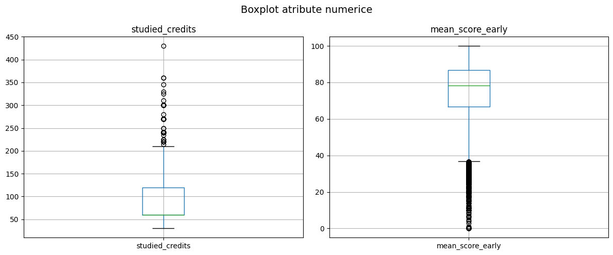

* **`highest_education`**: Analizând histograma pentru acest atribut categorial, am observat o distribuție puternic dezechilibrată la nivelul populației de studenți. Majoritatea covârșitoare se încadrează în categoriile de mijloc: "A Level or Equivalent" (cea mai frecventă, cu aproape 7000 de exemple) urmată îndeaproape de "Lower Than A Level". La polul opus, categoriile extreme, "Post Graduate Qualification" și "No Formal quals", au o frecvență extrem de scăzută (reprezentând o fracțiune marginală din total). Acest dezechilibru masiv în categoriile educaționale ne arată că modelul va avea mult mai multe exemple din care să învețe tiparele studenților cu educație medie, în timp ce predicțiile pentru extremele academice s-ar putea baza pe prea puține date pentru a fi la fel de robuste.

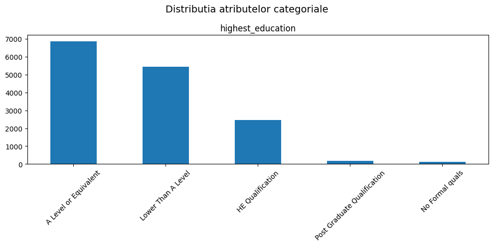

Pentru a înțelege mai bine dimensiunea și natura datelor, am extras statisticile descriptive de bază pentru atributele analizate.

**Statistici pentru atribute numerice continue:**

| Atribut | count | mean | std | min | 25% | 50% (mediană) | 75% | max |
| :--- | :--- | :--- | :--- | :--- | :--- | :--- | :--- | :--- |
| **studied_credits** | 15041.0 | 80.72 | 37.36 | 30.0 | 60.00 | 60.00 | 120.00 | 430.0 |
| **mean_score_early** | 15013.0 | 74.35 | 17.19 | 0.0 | 66.67 | 78.33 | 86.67 | 100.0 |

**Statistici pentru atribute discrete/categoriale:**

| Atribut | count | unique |
| :--- | :--- | :--- |
| **highest_education** | 15041 | 5 |

### 1.2. Echilibrul de clase

În urma vizualizării atributului țintă `final_result` (printr-un bar plot), s-a observat un dezechilibru semnificativ între clase:
* **Clasa majoritară:** "Pass" (studenții care au promovat).
* **Clasa minoritară:** "Distinction" (studenții cu rezultate excepționale).

Acest dezechilibru ne indică faptul că acuratețea (Accuracy) poate fi o metrică înșelătoare. Un model ar putea prezice majoritar clasa "Pass" și ar obține o acuratețe ridicată, dar ar eșua în a identifica corect studenții din celelalte categorii. Din acest motiv, evaluarea se va baza puternic și pe metricile **F1-Score**, **Precision** și **Recall**.

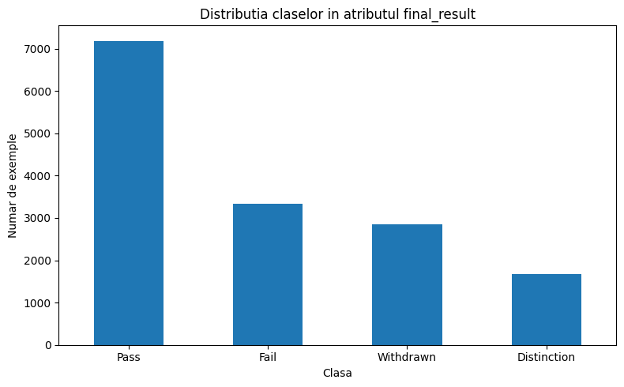

### 1.3. Corelații între atribute
Pentru a înțelege puterea de predicție a atributelor, am analizat corelațiile acestora cu ambele sarcini (clasificare și regresie):

* **Atribut numeric vs. clasificare:** Analizând boxplot-ul `mean_score_early` în funcție de `final_result`, am observat o progresie vizibilă a medianelor, dar și o suprapunere semnificativă a distribuțiilor. Studenții din clasa "Distinction" prezintă cea mai mare mediană (în jur de 90) și o variație mai mică a notelor. Clasa "Pass" are o mediană de aproximativ 80. În schimb, clasele "Fail" și "Withdrawn" au mediane foarte apropiate (în jur de 70) și o dispersie mult mai mare a scorurilor (box-urile sunt vizibil mai extinse). Faptul că intervalele acestor note inițiale se suprapun destul de mult este o descoperire cheie: explică de ce granița de decizie este fină și de ce modelul de clasificare confundă adesea clasele vecine (cum ar fi "Pass" cu "Fail").

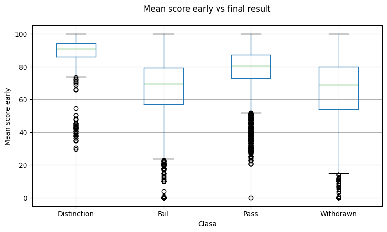

* **Atribut categorial vs. clasificare:** Testul Chi-Square aplicat între `highest_education` și `final_result` a returnat un p-value de 0.0000, demonstrând o dependență statistică clară. Analizând graficul de bare grupate, putem observa exact cum influențează educația rezultatul: studenții din categoria „Lower Than A Level” prezintă o proporție vizibil mai mare de eșec („Fail”) și abandon („Withdrawn”) comparativ cu performanțele de top („Distinction”). În schimb, pe măsură ce nivelul de educație crește (ex: „HE Qualification” sau „A Level or Equivalent”), clasa „Pass” domină autoritar, iar raportul dintre „Distinction” și „Fail” se îmbunătățește semnificativ. Concluzia vizuală este că un background educațional mai solid reduce considerabil riscul de abandon și eșec, crescând șansele de promovare.

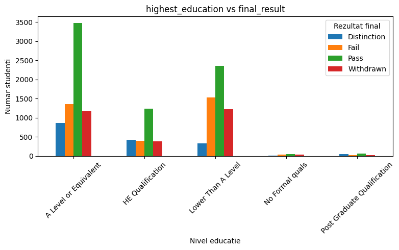

* **Atribut numeric vs. regresie:** Am calculat coeficientul de corelație Pearson între `mean_score_early` și `final_coursework_score`, obținând o valoare foarte ridicată, **r = 0.8185**. Dincolo de această valoare statistică, plot-ul ne oferă detalii structurale importante: deși "norul" de puncte urmează o diagonală ascendentă clară (confirmând relația liniară puternică), densitatea maximă este în cadranul superior drept, indicând că majoritatea studenților obțin scoruri mari la ambele evaluări. Foarte interesantă este prezența unei linii dense perfect aliniate pe diagonala y=x, sugerând că pentru un număr semnificativ de studenți nota timpurie rămâne neschimbată până la final. Totuși, dispersia largă în anumite zone și prezența outlierilor (ex: studenți cu scor timpuriu de aproape 100, dar scor final 0, probabil din cauza abandonului pe parcurs, sau invers, studenți care au recuperat masiv) ne explică de ce modelele de regresie rețin o eroare și de ce au nevoie de trăsături suplimentare pentru a capta aceste excepții comportamentale.

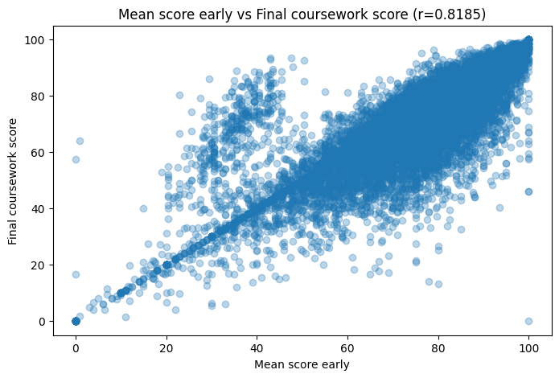

* **Atribut categorial vs. regresie:** Boxplot-ul care corelează nivelul de educație (`highest_education`) cu scorul final (`final_coursework_score`) ilustrează o tendință foarte clară: pe măsură ce nivelul de calificare anterioară crește, performanța la curs devine mai predictibilă și mai ridicată. De exemplu, categoria de top, „Post Graduate Qualification”, prezintă cea mai mare mediană (aproximativ 85 de puncte) și cea mai mică dispersie a notelor, indicând rezultate constant bune. La polul opus, studenții din categoria „No Formal quals” au cea mai mică mediană (în jur de 63 de puncte) și cea mai largă variație a notelor din mijlocul distribuției. De asemenea, este interesant de observat densitatea masivă de outlieri inferiori (note spre 0) prezentă în aproape toate categoriile, ceea ce sugerează că abandonul sau nepredarea temelor apar indiferent de background-ul academic. Această analiză detaliată justifică pe deplin includerea acestui atribut categorial în modelele de regresie, deoarece îi oferă algoritmului un „baseline” de așteptare în funcție de profilul studentului.

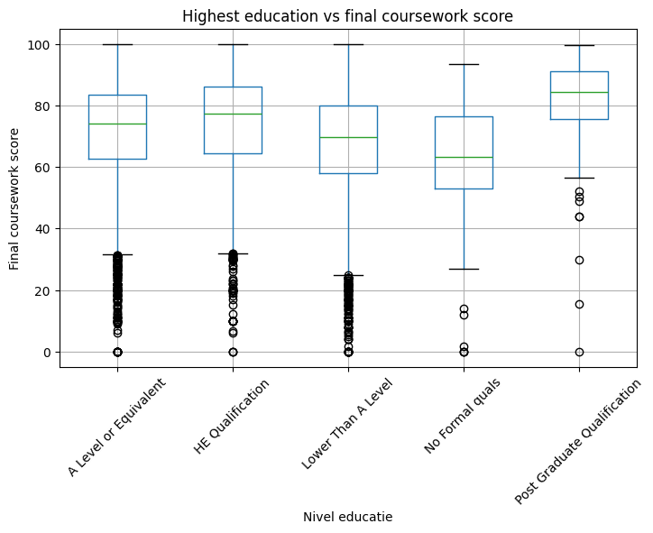

---

## 2. Preprocesarea datelor

Etapele de preprocesare au fost aplicate pentru a curăța datele, a corecta anomaliile și a facilita convergența algoritmilor.

1.  **Encodare ordinală și categorică:** Atributul `clicks_freq_init` a fost encodat ordinal (low=0, mid=1, high=2) pentru a păstra relația de ordine inerentă. Pentru restul atributelor categoriale, am utilizat `OneHotEncoder` pentru a nu induce o ordine artificială.

2.  **Eliminarea data leakage:** Am eliminat coloana `date_unregistration`. Aceasta conținea informații despre momentul retragerii, oferind modelului o "scurtătură" nerealistă pentru a prezice clasa "Withdrawn". Păstrarea ei ar fi cauzat overfitting.

3.  **Tratarea valorilor lipsă (Imputare logică și statistică):** 
    * M-am concentrat în primul rând pe imputarea atributului `mean_score_early`. Am ales intenționat această coloană pentru a fi tratată deoarece, așa cum a reieșit din explorarea datelor (EDA), scorul obținut devreme de student este un predictor critic și extrem de puternic pentru ambele sarcini (clasificare și regresie). Eliminarea rândurilor cu date lipsă pe această coloană ar fi dus la o pierdere de informație vitală. 
    * Pentru a completa datele lipsă, am utilizat `SimpleImputer` cu strategia mediană. Am ales mediana în detrimentul mediei clasice tocmai din cauza observațiilor din graficul boxplot: distribuția acestui atribut prezintă o "coadă" densă de outlieri inferiori, iar mediana este o metrică mult mai robustă, care nu se lasă distorsionată de aceste valori extreme.
    * Suplimentar, pentru a curăța complet setul de date, valorile NaN din coloanele asociate click-urilor au fost completate cu `0` (lipsa logării echivalează cu 0 accesări), iar atributele categoriale (ex: `imd_band`) au fost completate cu valoarea cea mai frecventă (most_frequent).

4.  **Tratarea outlierilor:** Folosind metoda **IQR (Inter-Quartile Range)** pe atributul `mean_score_early`, am identificat valorile extreme, le-am transformat temporar în `NaN` și le-am înlocuit prin imputare cu mediana, pentru a nu distorsiona regresorii liniari.

5.  **Tratarea redundanței:** În urma analizei matricei de corelație Pearson pentru atributele numerice, am identificat perechi de variabile cu o corelație foarte strânsă (r > 0.8), cum ar fi `n_assessments_early`, `refs_forumng` sau `clicks_homepage` (care variază adesea simultan cu volumul total de interacțiuni ale studentului). Deoarece modelele liniare pe care le-am utilizat ulterior (Regresia Logistică și Regresia Ridge/Lasso) sunt deosebit de sensibile la multicoliniaritate – fenomen care poate destabiliza coeficienții modelului, crescând varianța și făcând interpretarea importanței atributelor imposibilă – am decis eliminarea redundanțelor. Din fiecare pereche puternic corelată, am păstrat un singur atribut reprezentativ: l-am ales pe cel care prezenta o corelație individuală superioară cu variabila țintă (`final_result` sau `final_coursework_score`) sau pe cel care oferea o informație mai bine agregată. Această etapă de *feature selection* a redus dimensionalitatea datelor și riscul de overfitting, păstrând în același timp intactă puterea predictivă a modelului.

6.  **Standardizare:** Am aplicat `StandardScaler` pe toate atributele numerice pentru a aduce valorile în același interval de magnitudine.

---

## 3. Algoritmi de învățare automată

### 3.1. Abordarea folosită pentru clasificare

Pentru sarcina de clasificare, obiectivul a fost predicția atributului `final_result`. 

#### 3.1.1. Encodarea atributelor categoriale
Pentru a putea antrena modelele matematice, am transformat datele astfel:
*   **Variabila țintă (`final_result`):** A fost transformată numeric folosind `LabelEncoder`.
*   **Restul atributelor predictor categoriale:** Au fost procesate folosind `OneHotEncoder` pentru a evita impunerea unei relații de ordine artificiale între categorii (ex: regiuni sau tipuri de educație).

#### 3.1.2. Modele utilizate și jurnalizarea experimentelor
Am pornit de la un model de bază și am crescut complexitatea treptat:
1.  **Decision Tree (Baseline):** Am rulat inițial algoritmul cu parametrii default. Pentru a preveni overfitting-ul (care ducea la un model prea complex), am  variat hiperparametrul `max_depth` în intervalul [5, 6, 7, 8, 9, 10, 15, 20, 25]. Acuratețea maximă pe validare a fost atinsă la adâncimea 6.

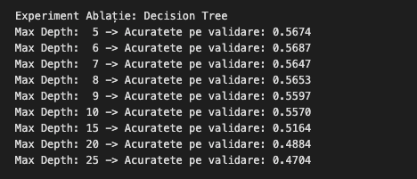

2.  **Random Forest:** Am dorit să testez un ansamblu de arbori pentru a crește robustețea. Am experimentat cu trei configurații, variind numărul de estimatori (`n_estimators` între 200 și 300) și controlând creșterea arborilor prin `max_depth` și `min_samples_leaf`.

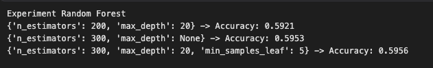

3.  **Logistic Regression:** Datorită prezenței multor coloane rezultate din One-Hot Encoding (sparse data), am testat un model liniar robust. Am variat parametrul de regularizare inversă `C` ([0.1, 1.0, 10.0]) folosind solver-ul 'saga'.

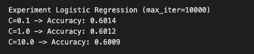

---

### 3.2. Abordarea folosită pentru regresie

Obiectivul a fost predicția variabilei continue `final_coursework_score`.

#### 3.2.1. Modele utilizate și jurnalizarea experimentelor
1.  **Linear Regression (Baseline):** A fost folosit pentru a stabili o linie de referință (un MAE de 5.10 pe setul de validare).
2.  **Regularizarea L1 (Lasso) și L2 (Ridge):** Pentru a rafina modelul, am aplicat penalizări asupra coeficienților, variind factorul `alpha` în plaja [0.1, 1.0, 10.0, 100.0] pentru ambele modele.

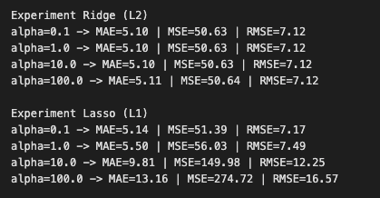

Analizând graficele de eroare, am observat că performanța se degradează pe măsură ce parametrul `alpha` crește. Curbele de eroare sunt strâns lipite, ceea ce indică lipsa overfitting-ului în modelul de bază. O regularizare puternică împinge modelul în **underfitting**. Regularizarea L2 (Ridge) cu un alpha foarte mic s-a dovedit a fi abordarea optimă.

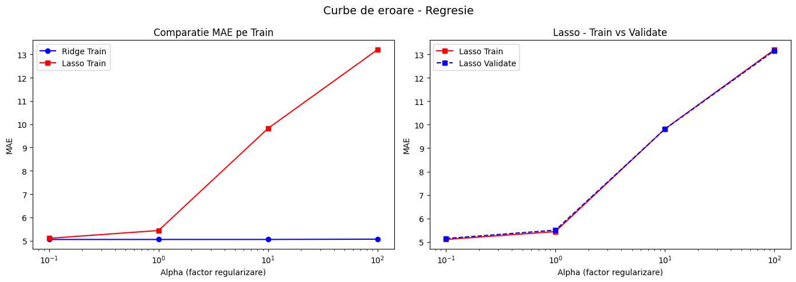

---

### 3.3. Evaluarea algoritmilor

#### 3.3.1. Hiperparametrii finali setați
Pentru a obține cele mai bune rezultate, seturile finale de hiperparametri pentru fiecare algoritm au fost următoarele:
*   **Decision Tree:** `max_depth = 6`, `random_state = 42`.
*   **Random Forest:** `n_estimators = 300`, `max_depth = 20`, `min_samples_leaf = 5`, `random_state = 42`.
*   **Logistic Regression:** `C = 1.0`, `max_iter = 10000`, `solver = 'saga'`, `random_state = 42`.
*   **Ridge Regression:** `alpha = 1.0`.

#### 3.3.2. Tabel comparativ - Clasificare
Mai jos este prezentată performanța pe setul de validare. Valorile maxime sunt evidențiate cu **bold**. 

| Model | Acuratețe | Distinction (Prec/Rec/F1) | Fail (Prec/Rec/F1) | Pass (Prec/Rec/F1) | Withdrawn (Prec/Rec/F1) |
| :--- | :--- | :--- | :--- | :--- | :--- |
| Decision Tree (max_depth=6) | 0.5687 | 0.5057 / 0.2051 / 0.2919 | 0.4485 / 0.3002 / 0.3597 | 0.5903 / 0.8964 / 0.7118 | 0.6314 / 0.2639 / 0.3722 |
| Random Forest (n=300, max_depth=20, min_samples_leaf=5) | 0.5956 | **0.6026** / 0.2191 / 0.3214 | 0.5066 / 0.3257 / 0.3965 | 0.6071 / **0.9108** / **0.7286** | **0.6366** / 0.3324 / 0.4367 |
| **Logistic Regression (C=1.0)** | **0.6012** | 0.5833 / **0.3753** / **0.4567** | **0.5180** / **0.3487** / **0.4168** | **0.6266** / 0.8554 / 0.7234 | 0.5763 / **0.3823** / **0.4597** |

#### 3.3.3. Matrice de confuzie pentru cele mai bune modele

**Pe seturile de validare:**

|  |  |  |
| :---: | :---: | :---: |
| 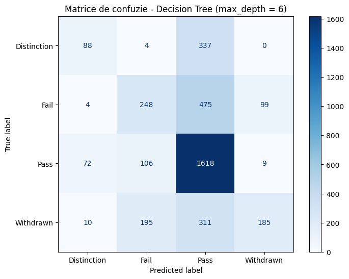  | 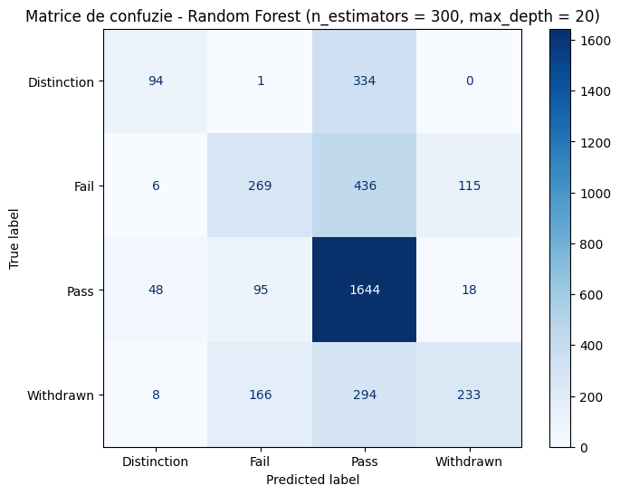  |   |

**Pe setul de test:**

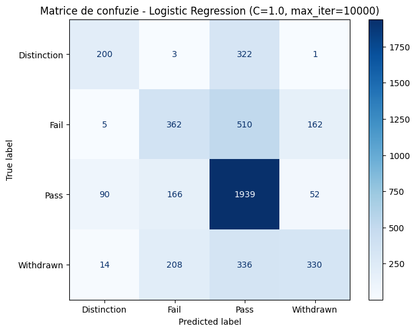

#### 3.3.4. Tabel comparativ - Regresie

| Model | MAE | MSE | RMSE | R² |
| :--- | :--- | :--- | :--- | :--- |
| Linear Regression | **5.10** | **50.63** | **7.12** | **0.8157** |
| **Ridge (alpha=1.0)** | **5.10** | **50.63** | **7.12** | **0.8157** |
| Lasso (alpha=0.1) | 5.14 | 51.39 | 7.17 | 0.8129 |

#### 3.3.5. Interpretarea rezultatelor
*   **De ce a câștigat Regresia Logistică?** Deși Random Forest este un model mai complex, setul nostru de date a fost transformat prin `OneHotEncoder`, rezultând un spațiu al atributelor foarte larg și cu multe valori nule (sparse data). Modelele liniare precum Regresia Logistică, în combinație cu datele standardizate anterior (`StandardScaler`), excelează în găsirea granițelor de decizie pe date de acest tip.
*   **Interpretarea Matricei de confuzie (pentru cel mai bun model):** Analizând matricea pentru Regresia Logistică, am observat că modelul tinde să confunde cel mai des clasele **Pass** și **Fail**. Prezice adesea "Pass" pentru studenți care, în realitate, au picat (Fail). Aceasta se explică prin faptul că "Pass" este clasa dominantă în setul de antrenare, dar și vizual prin boxplot-ul din faza EDA, unde s-a demonstrat că medianele notelor timpurii pentru aceste două clase sunt apropiate, iar intervalele se suprapun considerabil.
*   **Performanța la regresie:** Valoarea mare a coeficientului R² (~0.82) arată că modelele de regresie captează excelent variația datelor. Modelul **Ridge** a avut cel mai bun comportament deoarece regularizarea L2 micșorează ponderile atributelor mai puțin importante, fără a le elimina complet (cum face Lasso), stabilizând astfel predicția fără a pierde informație utilă.
---

## 4. Concluzii

Această temă a demonstrat în mod practic faptul că succesul unui sistem de Machine Learning nu depinde exclusiv de complexitatea algoritmului ales, ci, în mod fundamental, de calitatea și rigoarea etapei de preprocesare a datelor. Decizii precum tratarea robustă a outlierilor prin metoda IQR sau standardizarea corectă a trăsăturilor au format fundația pe care s-a putut construi o predicție stabilă.

Pe **sarcina de clasificare**, experimentele au scos la iveală un aspect tehnic important: modelele liniare (precum Regresia Logistică) pot depăși ansambluri complexe (precum Random Forest) atunci când spațiul trăsăturilor devine rarefiat, fenomen apărut direct în urma aplicării `OneHotEncoder`. În plus, analiza dezechilibrului de clase ne-a forțat să privim dincolo de iluzia unei acurateți globale mari, matricele de confuzie confirmând cât de fină și dificil de trasat este granița decizională între studenții care trec cursul la limită ("Pass") și cei care eșuează ("Fail").

Pe **sarcina de regresie**, stabilitatea modelelor a fost remarcabilă. Performanța ridicată (cu un R² de peste 0.81) și curbele de eroare suprapuse au demonstrat că datele au o structură liniară puternică. Regularizarea L2 ușoară (Ridge cu alpha=1.0) a fost exact ajustarea necesară pentru a stabiliza coeficienții fără a pierde informație utilă, evitând astfel capcana underfitting-ului observată la penalizări mai stricte.

În ansamblu, aceste rezultate confirmă principiul fundamental conform căruia o abordare algoritmică aliniată la topologia datelor, susținută de o preprocesare riguroasă, asigură un echilibru optim între bias și varianță, maximizând astfel capacitatea de generalizare a sistemului în fața datelor noi.
